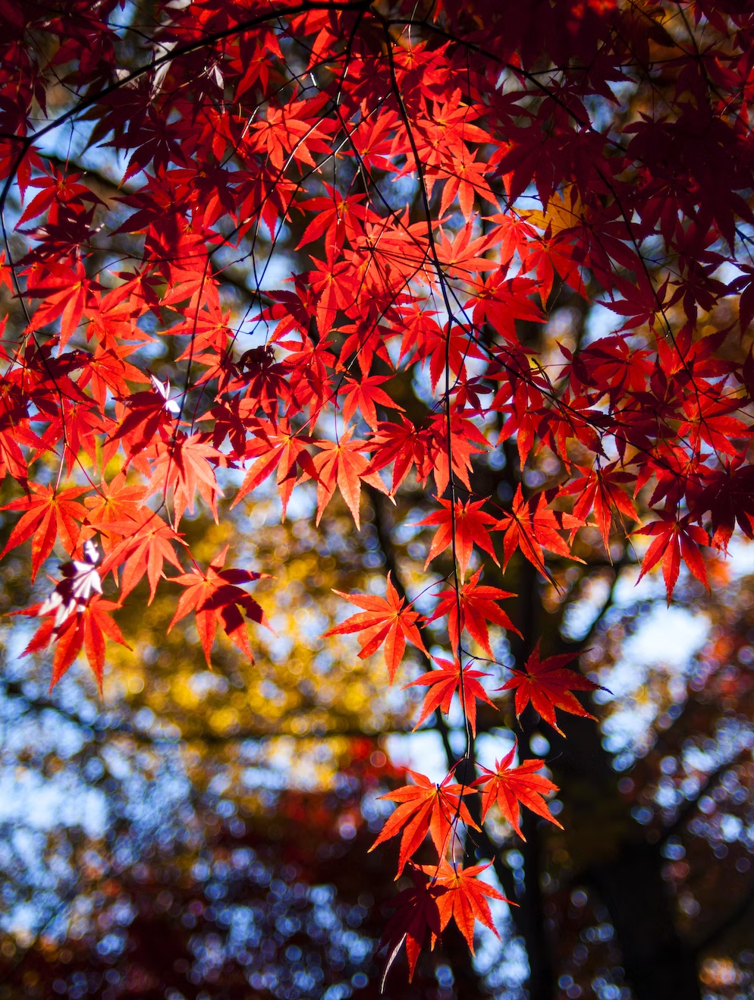
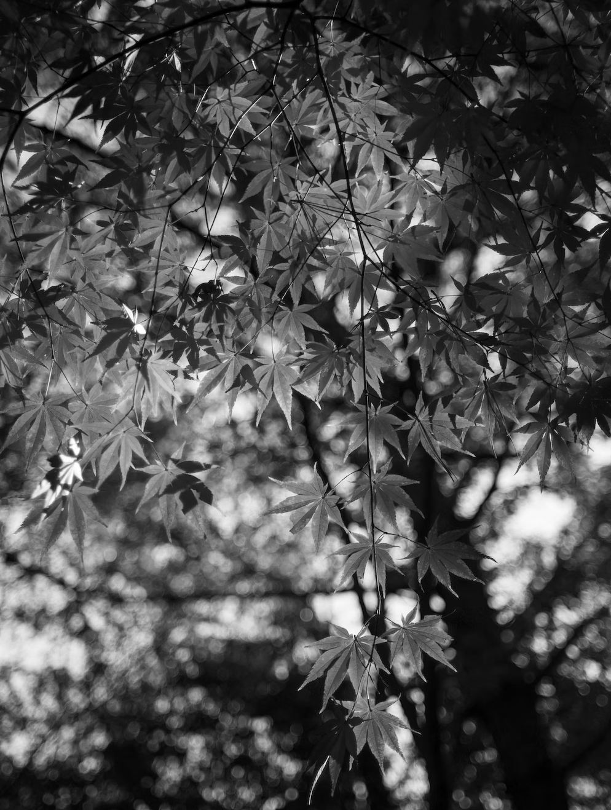

# Image Filter

This program reads in an image file and outputs the associated image filter applied to it. The available filters for images are:

1. mirror: flips the image about the y-axis
2. grey: greys out the colours of the pixels
3. invert: swaps the max and min values of pixels resulting in colour change of image
4. compress: compresses dimensions of the image given

Refer to the ImageFilterTest class to run visual representations of image filters applied to the "tree.png" image.

# Image Filters

**Original Image**

**Mirror:**

**Grey:**

**Invert:**

**Compress:**
- NOTE: The size of image gets compressed each run of compress function. Run the function multiple times to see visual change for image quality being compressed
  

